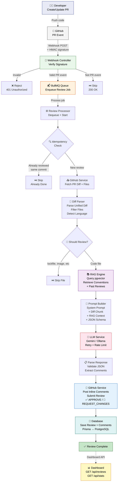
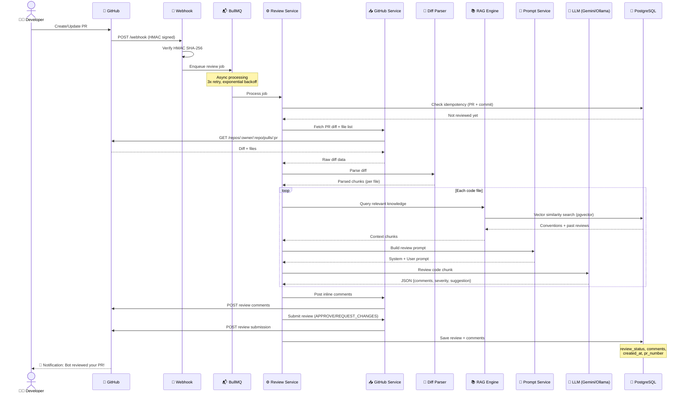

# AI Code Review Bot — Final Application Flow

## Luồng hoạt động chính (End-to-End)

```mermaid
flowchart TD
    DEV["👨‍💻 Developer\nCreate/Update PR"] -->|Push code| GH["🐙 GitHub\nPR Event"]
    GH -->|Webhook POST\n+ HMAC signature| WH["🔔 Webhook Controller\nVerify Signature"]

    WH -->|Invalid| REJECT["❌ Reject\n401 Unauthorized"]
    WH -->|Valid PR event| QUEUE["📬 BullMQ Queue\nEnqueue Review Job"]
    WH -->|Not PR event| SKIP["⏭️ Skip\n200 OK"]

    QUEUE -->|Process job| PROC["⚙️ Review Processor\nDequeue + Start"]

    PROC --> IDEM{"🔍 Idempotency\nCheck"}
    IDEM -->|Already reviewed\nsame commit| DONE_SKIP["⏭️ Skip\nAlready Done"]
    IDEM -->|New review| FETCH

    FETCH["📥 GitHub Service\nFetch PR Diff + Files"] --> PARSE

    PARSE["🔪 Diff Parser\nParse Unified Diff\nFilter Files\nDetect Language"] --> FILTER

    FILTER{"📁 Should Review?"}
    FILTER -->|lockfile, image, etc| SKIP2["⏭️ Skip File"]
    FILTER -->|Code file| RAG

    RAG["📚 RAG Engine\nQuery pgvector\nRetrieve Conventions\n+ Past Reviews"] --> PROMPT

    PROMPT["📝 Prompt Builder\nSystem Prompt\n+ Diff Chunk\n+ RAG Context\n+ JSON Schema"] --> LLM

    LLM["🤖 LLM Service\nGemini / Ollama\nRetry + Rate Limit"] --> PARSE_RESP

    PARSE_RESP["📋 Parse Response\nValidate JSON\nExtract Comments"] --> POST

    POST["💬 GitHub Service\nPost Inline Comments\nSubmit Review\n✅ APPROVE / 🔄 REQUEST_CHANGES"] --> SAVE

    SAVE["💾 Database\nSave Review + Comments\nPrisma → PostgreSQL"] --> DONE["✅ Review Complete"]

    DONE -.->|Dashboard API| DASH["📊 Dashboard\nGET /api/reviews\nGET /api/stats"]

    style DEV fill:#e8eaf6,stroke:#283593,color:#000
    style GH fill:#f5f5f5,stroke:#424242,color:#000
    style WH fill:#e8f5e9,stroke:#2e7d32,color:#000
    style QUEUE fill:#fff3e0,stroke:#e65100,color:#000
    style LLM fill:#fce4ec,stroke:#c62828,color:#000
    style RAG fill:#f3e5f5,stroke:#6a1b9a,color:#000
    style POST fill:#e3f2fd,stroke:#1565c0,color:#000
    style SAVE fill:#e0f2f1,stroke:#00695c,color:#000
    style DONE fill:#c8e6c9,stroke:#1b5e20,color:#000
    style DASH fill:#fff9c4,stroke:#f57f17,color:#000
```

## Sequence Diagram — Chi tiết tương tác

```mermaid
sequenceDiagram
    actor Dev as 👨‍💻 Developer
    participant GH as 🐙 GitHub
    participant WH as 🔔 Webhook
    participant Q as 📬 BullMQ
    participant RS as ⚙️ Review Service
    participant GS as 📥 GitHub Service
    participant DP as 🔪 Diff Parser
    participant RAG as 📚 RAG Engine
    participant PS as 📝 Prompt Service
    participant LLM as 🤖 LLM (Gemini/Ollama)
    participant DB as 💾 PostgreSQL

    Dev->>GH: Create/Update PR
    GH->>WH: POST /webhook (HMAC signed)
    WH->>WH: Verify HMAC SHA-256
    WH->>Q: Enqueue review job

    Note over Q: Async processing<br/>3x retry, exponential backoff

    Q->>RS: Process job
    RS->>DB: Check idempotency (PR + commit)
    DB-->>RS: Not reviewed yet

    RS->>GS: Fetch PR diff + file list
    GS->>GH: GET /repos/:owner/:repo/pulls/:pr
    GH-->>GS: Diff + files
    GS-->>RS: Raw diff data

    RS->>DP: Parse diff
    DP-->>RS: Parsed chunks (per file)

    loop Each code file
        RS->>RAG: Query relevant knowledge
        RAG->>DB: Vector similarity search (pgvector)
        DB-->>RAG: Conventions + past reviews
        RAG-->>RS: Context chunks

        RS->>PS: Build review prompt
        PS-->>RS: System + User prompt

        RS->>LLM: Review code chunk
        LLM-->>RS: JSON {comments, severity, suggestion}
    end

    RS->>GS: Post inline comments
    GS->>GH: POST review comments
    RS->>GS: Submit review (APPROVE/REQUEST_CHANGES)
    GS->>GH: POST review submission

    RS->>DB: Save review + comments
    Note over DB: review_status, comments,<br/>created_at, pr_number

    GH-->>Dev: 🔔 Notification: Bot reviewed your PR!
```
