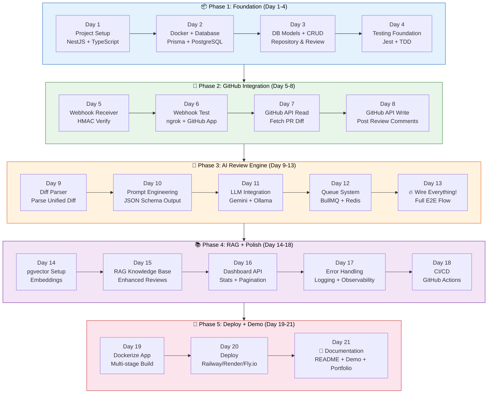

# AI Code Review Bot — Roadmap Timeline

```mermaid
flowchart TD
    subgraph P1["📦 Phase 1: Foundation (Day 1-4)"]
        D1["Day 1\nProject Setup\nNestJS + TypeScript"]
        D2["Day 2\nDocker + Database\nPrisma + PostgreSQL"]
        D3["Day 3\nDB Models + CRUD\nRepository & Review"]
        D4["Day 4\nTesting Foundation\nJest + TDD"]
        D1 --> D2 --> D3 --> D4
    end

    subgraph P2["🔗 Phase 2: GitHub Integration (Day 5-8)"]
        D5["Day 5\nWebhook Receiver\nHMAC Verify"]
        D6["Day 6\nWebhook Test\nngrok + GitHub App"]
        D7["Day 7\nGitHub API Read\nFetch PR Diff"]
        D8["Day 8\nGitHub API Write\nPost Review Comments"]
        D5 --> D6 --> D7 --> D8
    end

    subgraph P3["🤖 Phase 3: AI Review Engine (Day 9-13)"]
        D9["Day 9\nDiff Parser\nParse Unified Diff"]
        D10["Day 10\nPrompt Engineering\nJSON Schema Output"]
        D11["Day 11\nLLM Integration\nGemini + Ollama"]
        D12["Day 12\nQueue System\nBullMQ + Redis"]
        D13["Day 13\n🔥 Wire Everything!\nFull E2E Flow"]
        D9 --> D10 --> D11 --> D12 --> D13
    end

    subgraph P4["📚 Phase 4: RAG + Polish (Day 14-18)"]
        D14["Day 14\npgvector Setup\nEmbeddings"]
        D15["Day 15\nRAG Knowledge Base\nEnhanced Reviews"]
        D16["Day 16\nDashboard API\nStats + Pagination"]
        D17["Day 17\nError Handling\nLogging + Observability"]
        D18["Day 18\nCI/CD\nGitHub Actions"]
        D14 --> D15 --> D16 --> D17 --> D18
    end

    subgraph P5["🚀 Phase 5: Deploy + Demo (Day 19-21)"]
        D19["Day 19\nDockerize App\nMulti-stage Build"]
        D20["Day 20\nDeploy\nRailway/Render/Fly.io"]
        D21["Day 21\n🎉 Documentation\nREADME + Demo + Portfolio"]
        D19 --> D20 --> D21
    end

    P1 --> P2 --> P3 --> P4 --> P5

    style P1 fill:#e3f2fd,stroke:#1565c0,color:#000
    style P2 fill:#e8f5e9,stroke:#2e7d32,color:#000
    style P3 fill:#fff3e0,stroke:#e65100,color:#000
    style P4 fill:#f3e5f5,stroke:#6a1b9a,color:#000
    style P5 fill:#fce4ec,stroke:#c62828,color:#000
```
